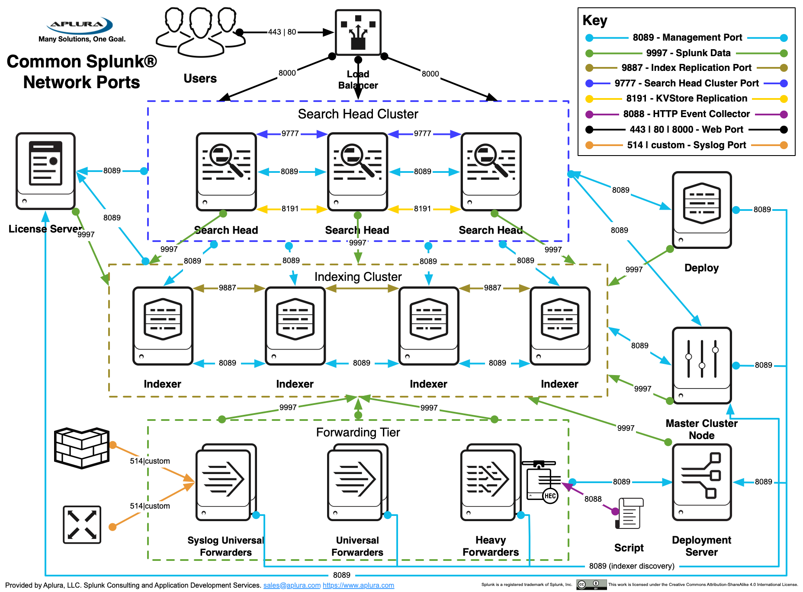

今天准备跟大家分享一下Splunk的架构

首先Splunk这个软件本身是个多面手，这个软件独立可以完成几乎所有大家对Splunk所认知的功能，包括接收日志，处理日志，储存日志，搜索日志，告警，报告，图表等的功能一应俱全。而这么多的功能其实是靠Splunk扮演不同的角色去实现的。

今天准备跟大家拆解一下Splunk，同时介绍几个基本的splunk角色以及部署类型

## Splunk basic roles:

这里主要先介绍四个经常会见到的词：

**Splunk Instance**:

这是一个独立的Splunk Enterprise实例，可以扮演一种或者同时扮演多种角色实现不同的功能。

**Indexer**: 

一个Splunk Enterprise实例，该实例为数据建立索引，将原始数据转换为事件并将结果放入索引中。 它还响应搜索请求来搜索索引数据。 

**Search Head（SH）**

在分布式搜索环境中，Splunk Enterprise实例专门处理搜索管理功能，将搜索请求定向到一组搜索对等方（indexer），然后将结果合并展示给用户。

**Universal Forwarder（UF）**

转发器的一种类型，负责将数据发送到指定一个或者多个Splunk Enterprise实例。

通用转发器是Splunk Enterprise的专用简化版本，仅包含转发数据所需的基本组件。 通用转发器不支持python，并且没有UI。

在大多数情况下，通用转发器是将数据转发到索引器的最佳方法。

## Splunk Deployment modes

1. **Standalone** mode

2. Non-Standalone mode
- Distributed Search
  
- SH Cluster (SHC)
  
- Indexer Cluster
  

## Splunk Distributed Search Overall Architecture

## 官方性能建议
|                          | < 2GB/day           | 2 to 300 GB/day     | 300 to 600 GB/day | 600GB to 1TB/day | 1 to 2TB/day    | 2 to 3TB/day    |
|--------------------------|---------------------|---------------------|-------------------|------------------|-----------------|-----------------|
| Total Users: less than 4 | 1 combined instance | 1 combined instance | 1 Search Head, 2 Indexers   | 1 Search Head, 3 Indexers     | 1 Search Head,7 Indexers     | 1 Search Head, 10 Indexers    |
| Total Users: up to 8     | 1 combined instance | 1 Search Head,  1 Indexers     | 1 Search Head, 2 Indexers    | 1 Search Head, 3 Indexers  | 1 Search Head,8 Indexers    | 1 Search Head, 12 Indexers   |
| Total Users: up to 16    | 1 Search Head,  1 Indexers    | 1 Search Head,  1 Indexers     | 1 Search Head,  3 Indexers   | 2 Search Heads,4 Indexers   | 2 Search Heads,10 Indexers | 2 Search Heads, 15 Indexers |
| Total Users: up to 24    | 1 Search Head,  1 Indexers    | 1 Search Head,  2 Indexers    | 2 Search Heads, 3 Indexers     | 2 Search Heads, 6 Indexers  | 2 Search Heads, 12 Indexers | 3 Search Heads, 18 Indexers|
| Total Users: up to 48    | 1 Search Head,  2 Indexers    | 1 Search Head,  2 Indexers     | 2 Search Heads, 4 Indexers   | 2 Search Heads,7 Indexers | 3 Search Heads, 14 Indexers | 3 Search Heads,21 Indexers |

---

具体的分享会在YouTube频道中更新，有任何问题欢迎在YouTube回复中提问
YouTube 链接是https://youtu.be/Qw5T_VbfNnE
如果不方便上YouTube ，可以邮件给我willhktube@gmail.com 

Cheers.